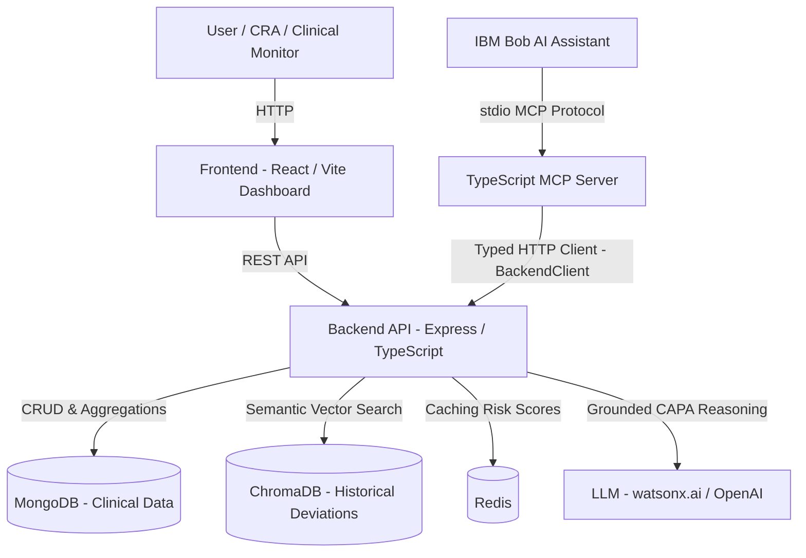

# Architecture — Clinical Trial Risk Monitor (CTRM)

## System Architecture



---

## Component Summary

| Component | Technology | Port | Responsibility |
|---|---|---|---|
| **Frontend** | React 18 + Vite + Tailwind CSS | 5173 | Monitoring dashboard, site risk map, deviation triage, CAPA review |
| **MCP Server** | TypeScript + `@modelcontextprotocol/sdk` 1.30.0 | stdio | Thin Bob interface — 8 tools, Zod validation, BackendClient delegation |
| **Backend API** | Express 4 + TypeScript | 3001 | Business logic, deviation detection, risk scoring, CAPA orchestration |
| **Vector Store** | ChromaDB | 8000 | Historical deviation embeddings for semantic similarity |
| **Primary Database** | MongoDB | 27017 | Persistent storage: trials, sites, patients, visits, deviations |
| **Cache** | Redis | 6379 | Calculated site risk scores (5-min TTL), deviation list cache (1-min TTL) |
| **AI / LLM** | watsonx.ai Granite / OpenAI | — | Grounded root cause analysis and CAPA recommendations |

---

## MCP Server Architecture

### Transport

Bob uses **stdio transport** for local development. The MCP server is launched as a subprocess by Bob using the config in `.bob/mcp.json`. For Docker/container deployments, `MCP_TRANSPORT=sse` switches to an HTTP+SSE server on port 3002.

```
IBM Bob
  │
  │  (spawns subprocess via .bob/mcp.json)
  ▼
node src/mcp-server/dist/index.js   ← stdio transport
  │
  │  (McpServer from @modelcontextprotocol/sdk v1.30.0)
  ▼
createServer()
  ├── registerGetPatientRecords()
  ├── registerGetProtocolSpec()
  ├── registerDetectDeviations()
  ├── registerClassifySeverity()
  ├── registerGetSiteRiskScore()
  ├── registerListHighRiskSites()
  ├── registerSearchSimilarDeviations()
  └── registerGenerateCapaReport()
```

### Tool Handler Pattern

Every tool follows the same thin-handler pattern. **No business logic lives in MCP handlers.**

```
Bob invokes tool
  │
  ▼
server.tool(name, description, zodShape, handler)
  │
  ▼
handleToolCall(toolName, async () => {         ← centralized error wrapper
    input = schema.parse(rawInput)             ← Zod validation
    logger.info({ tool, ...context })          ← structured logging
    return backendClient.method(input)         ← delegate to BackendClient
  })
  │
  ▼
BackendClient (typed HTTP client)
  │   timeout: 30s, Content-Type: application/json
  ▼
Backend Express API
  │
  ▼
Service layer (DeviationService / RiskScoreService / etc.)
  │
  ▼
MongoDB / Redis / ChromaDB / LLM
  │
  ▼
Structured JSON result → Bob
```

### Error Handling

All tool errors return structured JSON — never raw stack traces:

```json
{
  "isError": true,
  "content": [{
    "type": "text",
    "text": "{\"success\": false, \"error\": \"[SERVICE_UNAVAILABLE] Failed to connect to backend\"}"
  }]
}
```

---

## Data Flow

### 1. Protocol Ingestion & Baseline
Clinical trial protocols (visit schedules, required procedures, inclusion/exclusion criteria, prohibited medications) and patient visit records are seeded into MongoDB via `SeedService`. 200+ sites, 5,000+ patient visits.

### 2. Deterministic Deviation Detection
`DeviationService.detectDeviations()` — **no LLM, fully deterministic rules**:

| Rule | Deviation Category | Severity (ICH E6) |
|---|---|---|
| Visit > window late | `late_visit` | Minor |
| Visit < window early | `early_visit` | Minor |
| Required procedure missing | `missed_procedure` | Major |
| Prohibited medication taken | `prohibited_medication` | Major |
| Adherence < 80% | `dosing_error` | Major |

Visit window calculation: `actualDate − scheduledDate` vs. `protocol.allowedWindowDays.early/late`.

### 3. ICH E6 GCP Severity Classification
`DeviationService.classifySeverity()`:
- **By deviationId**: looks up stored category → deterministic rule table → confidence 1.0
- **By free text**: keyword heuristic (patient safety terms → Major, admin terms → Administrative, default → Minor) → confidence 0.7–0.85
- **Source**: always reported as `rule_engine` or `text_analysis`

### 4. Site Risk Scoring
`RiskScoreService.calculateSiteRiskScore()` — **deterministic weighted formula**:

```
score = (major × 15) + (minor × 5) + (admin × 1) + (open × 3) + (rate > 0.3 ? 10 : 0)
score = min(100, score)
```

Risk tiers: `critical` (≥75) / `high` (≥50) / `medium` (≥25) / `low` (<25)

Trend: 30-day rolling window vs. prior 30 days → `improving` / `stable` / `worsening`

Results cached in Redis (5-minute TTL), persisted back to MongoDB Site document.

### 5. Semantic Similarity Search
`ChromaService.searchSimilar()` — deviations are embedded and indexed in ChromaDB on detection. Semantic queries return ranked similar historical cases for CAPA precedent lookup.

### 6. Grounded CAPA Report Generation
`CapaReportService` orchestrates:
1. Load verified deviation data from MongoDB (no hallucinated facts)
2. Load site risk score from `RiskScoreService`
3. Retrieve similar historical cases from `ChromaService`
4. Build structured prompt with only verified context
5. Call LLM (watsonx.ai Granite or OpenAI) → structured CAPA draft
6. Validate LLM output schema before returning

**The LLM is never given the ability to invent patient facts.** Only verified data from steps 1–3 is passed as context.

### 7. IBM Bob Orchestration
Bob invokes MCP tools via stdio. Tools are discovered automatically via `tools/list`. Bob combines multiple tool calls in a single conversation turn to answer complex clinical monitoring questions.

---

## Security Design

| Concern | Mitigation |
|---|---|
| API key exposure | Keys stay in `src/.env`, never in `.bob/mcp.json` |
| Path traversal | All backend lookups use Mongoose model filters, never raw filesystem |
| Input injection | Every MCP tool input is Zod-validated before reaching backend |
| Stack trace leakage | `handleToolCall` catches all errors and returns `{success: false, error: message}` only |
| LLM hallucination | CAPA generation uses only verified MongoDB/Redis data as context |
| Dangerous approvals | No auto-approval of write operations in Bob settings |
| Machine-specific paths | `args` in `.bob/mcp.json` is workspace-relative (`src/mcp-server/dist/index.js`) |

---

## Directory Structure

```
src/
├── mcp-server/
│   ├── src/
│   │   ├── index.ts                  ← createServer() + startServer() + SSE HTTP server
│   │   ├── client/
│   │   │   └── BackendClient.ts      ← Typed HTTP client (singleton backendClient)
│   │   ├── config/
│   │   │   └── env.ts                ← Zod-validated environment
│   │   ├── tools/
│   │   │   ├── getPatientRecords.ts
│   │   │   ├── getProtocolSpec.ts
│   │   │   ├── detectDeviations.ts
│   │   │   ├── classifySeverity.ts
│   │   │   ├── getSiteRiskScore.ts
│   │   │   ├── listHighRiskSites.ts
│   │   │   ├── searchSimilarDeviations.ts
│   │   │   └── generateCapaReport.ts
│   │   └── utils/
│   │       ├── inputSchemas.ts       ← Zod schemas for all 8 tools
│   │       ├── toolHandler.ts        ← Centralized error wrapper
│   │       └── logger.ts             ← Pino (stdio-safe)
│   ├── tests/
│   │   ├── setup.ts                  ← NODE_ENV=test guard
│   │   └── unit/
│   │       ├── server.test.ts        ← 15 tool execution tests
│   │       └── inputSchemas.test.ts  ← 13 schema validation tests
│   └── dist/                         ← Compiled output (gitignored)
│
├── backend/
│   ├── src/
│   │   ├── routes/                   ← Express routers (patients, deviations, sites, protocols, reports)
│   │   ├── services/
│   │   │   ├── DeviationService.ts   ← Deviation detection + severity classification
│   │   │   ├── RiskScoreService.ts   ← Site risk scoring
│   │   │   ├── CapaReportService.ts  ← LLM-powered CAPA generation
│   │   │   ├── ChromaService.ts      ← Vector indexing + semantic search
│   │   │   ├── CacheService.ts       ← Redis wrapper
│   │   │   ├── LLMService.ts         ← watsonx.ai / OpenAI adapter
│   │   │   ├── PatientService.ts     ← Patient queries
│   │   │   ├── ProtocolService.ts    ← Protocol retrieval
│   │   │   └── SeedService.ts        ← Synthetic data generation
│   │   └── models/                   ← Mongoose models (Patient, Visit, Site, Protocol, Deviation)
│   └── tests/
│
├── frontend/
│   └── src/                          ← React + Tailwind + Vite
│
└── shared/                           ← Shared TypeScript types
```

---

## Test Coverage

| Suite | Tests | Coverage |
|---|---|---|
| MCP server — schema validation | 13 | All 8 tool input schemas |
| MCP server — tool execution | 15 | All 8 tools: happy-path + error cases |
| Backend API | 8 | Health, routes, service integration |
| Frontend | 1 | Component smoke test |
| **Total** | **37** | |
