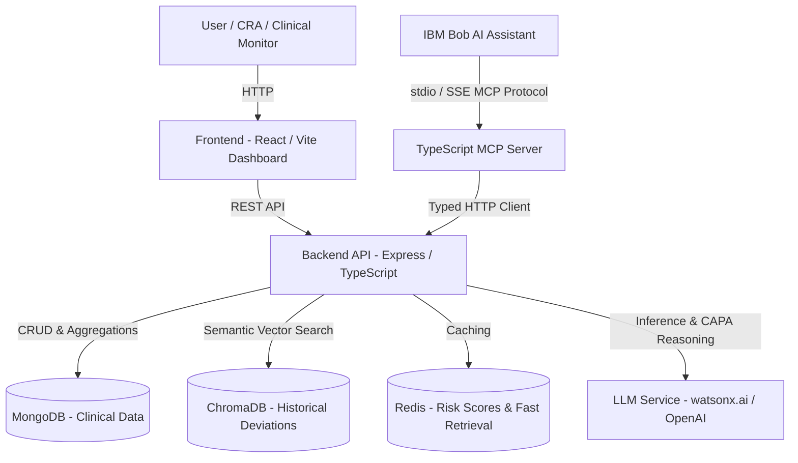

# Architecture — Clinical Trial Risk Monitor (CTRM)

## System Architecture

## Components

| Component | Technology | Responsibility |
|---|---|---|
| Frontend | React + Vite + TypeScript | Interactive monitoring dashboard, site risk map, deviation triage, CAPA review |
| MCP Server | TypeScript + `@modelcontextprotocol/sdk` | Thin controlled interface exposing 8 tools for IBM Bob |
| Backend API | Express + TypeScript | Core business logic, deviation detection rules, risk scoring, CAPA orchestration |
| Vector Store | ChromaDB | Historical deviation embeddings for semantic similarity and precedent retrieval |
| Primary Database | MongoDB | Persistent storage for trials, sites, patients, visits, and deviations |
| Cache | Redis | Caching calculated site risk scores and session data |
| AI / LLM | watsonx.ai / OpenAI | Grounded root cause analysis and CAPA recommendations |

## Data Flow

1. **Ingestion & Protocol Baseline**: Clinical trial protocols and patient visit records across 200+ sites and 5,000+ patients are ingested into MongoDB.
2. **Deterministic Deviation Detection**: The `DeviationService` checks visit windows, missed visits, dosage adherence, and banned co-medications against protocol specifications.
3. **ICH E6 GCP Severity Classification**: Detected deviations are classified as Major, Minor, or Administrative based on safety risk, primary endpoint impact, and data integrity.
4. **Site Risk Scoring**: `RiskScoreService` aggregates leading indicators into weighted 0–100 risk scores to rank sites.
5. **Semantic Similarity & Precedents**: `ChromaService` embeds deviations and retrieves similar historical cases to inform mitigations.
6. **CAPA Report Generation**: `CapaReportService` synthesizes verified facts and prompts the LLM to produce structured root cause analyses, corrective actions, and preventive measures.
7. **IBM Bob Orchestration**: IBM Bob invokes tools on the MCP server via `stdio` or `SSE` to query records, trigger detection, assess site risk, and generate CAPAs on demand.

## Security Considerations

- Environment variables isolate all credentials (`WATSONX_API_KEY`, `MONGODB_URI`, etc.).
- MCP server acts as a thin security boundary: never exposes database credentials, local filesystem paths, or raw stack traces.
- Tool input schemas are validated with Zod before reaching backend services.
- Grounded CAPA generation enforces zero patient fact hallucination.
